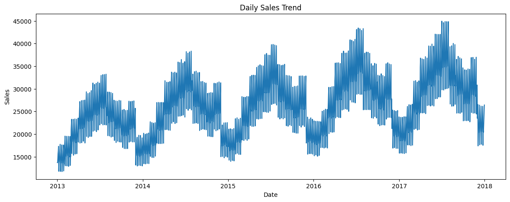
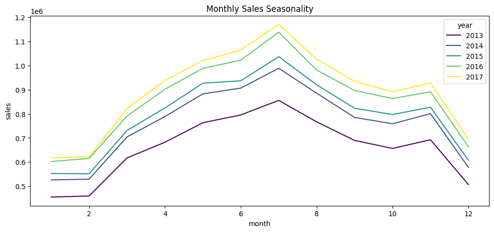
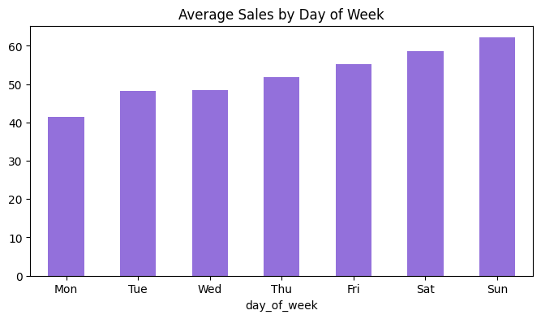
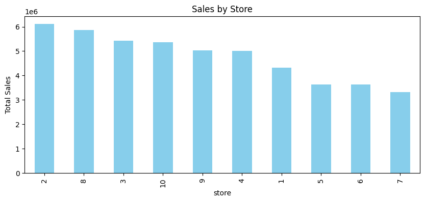
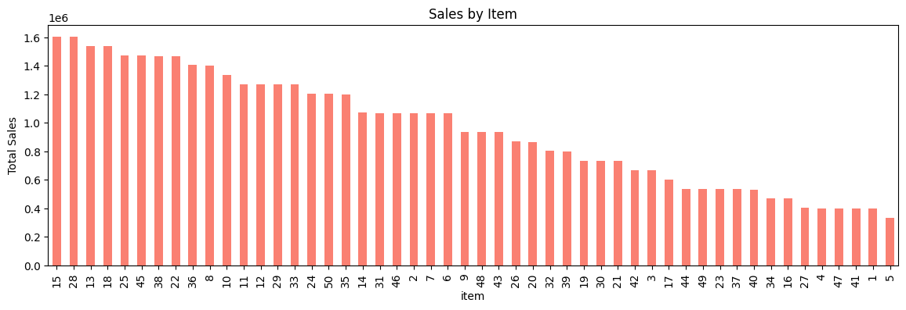
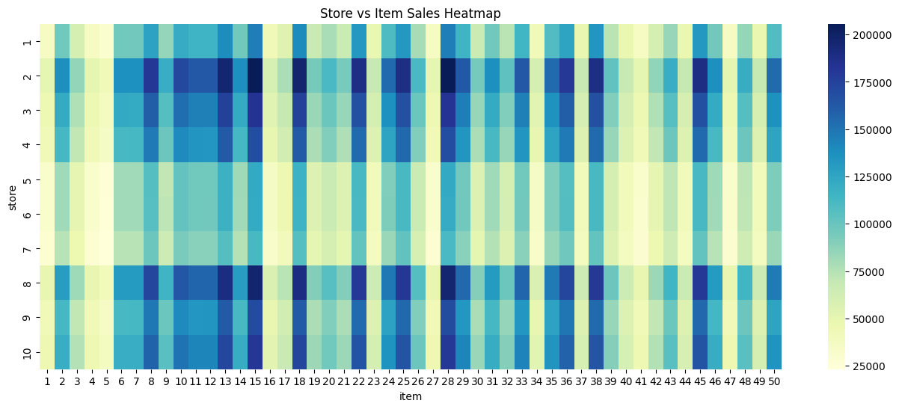
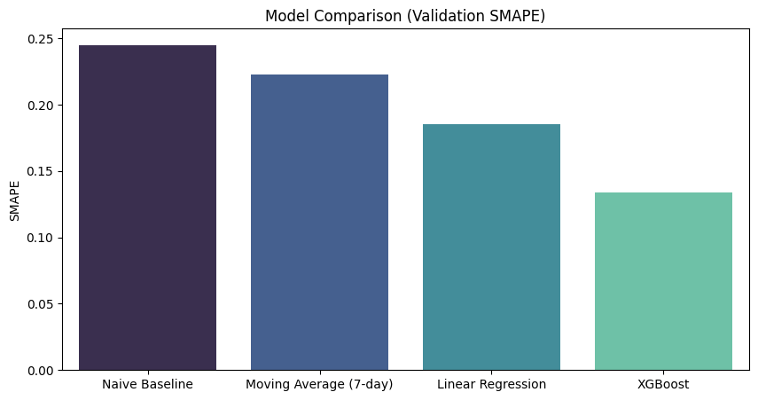
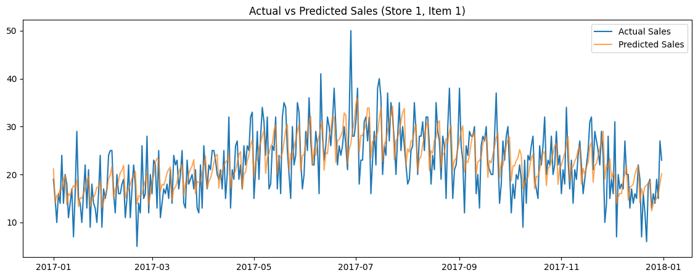

# Store Item Demand Forecasting - Analytical Report

## 1. Introduction and Business Problem
As a retail company, maintaining the correct amount of inventory is a delicate balance. 
- Predicting demand **too low** leads to stock-outs and lost sales.
- Predicting demand **too high** leads to excess inventory, meaning money tied up in unsold goods.

This project uses historical sales data (5 years of daily sales for 50 items across 10 stores) to predict future demand and optimize inventory planning. 

## 2. Exploratory Data Analysis
Before modeling, it's essential to understand the patterns in the data.

### 2.1 Overall Sales Trend
The overall daily sales exhibit a clear upward trend over the 5-year period, combined with strong recurring fluctuations.

### 2.2 Seasonality
We observed distinct seasonal patterns. Sales peak during the mid-year (June-July) and dip significantly around December and January.

Furthermore, analyzing sales by day of the week reveals that weekends generate significantly higher sales than weekdays.

### 2.3 Store and Item Analysis
Not all stores and items perform equally. Some stores clearly outperform others.

Similarly, there's a huge disparity in item popularity.

By looking at a cross-section of stores and items, we can identify our most valuable product-store combinations.

## 3. Modeling and Forecasting
To forecast demand, we used time-series techniques to engineer robust features:
- **Lag Features:** Sales from 1, 7, 14, and 28 days ago.
- **Rolling Features:** Moving averages over 7, 14, and 28-day windows.

To prevent data leakage, we rigorously separated the dataset temporally (Training: 2013-2016, Validation: 2017). 

### Model Performance
We evaluated various models, measuring their Symmetric Mean Absolute Percentage Error (SMAPE). Advanced models like XGBoost significantly outperformed simple baselines.

### Forecast vs Actual
Here is an example of the XGBoost model's predictions compared to actual sales for a specific store and item.

## 4. Conclusion
By incorporating robust time-series feature engineering (lags, rolling statistics, and temporal components), machine learning algorithms like XGBoost can effectively capture seasonality and trend. This enables accurate, localized predictions that directly drive actionable inventory management and planning decisions across retail operations.
